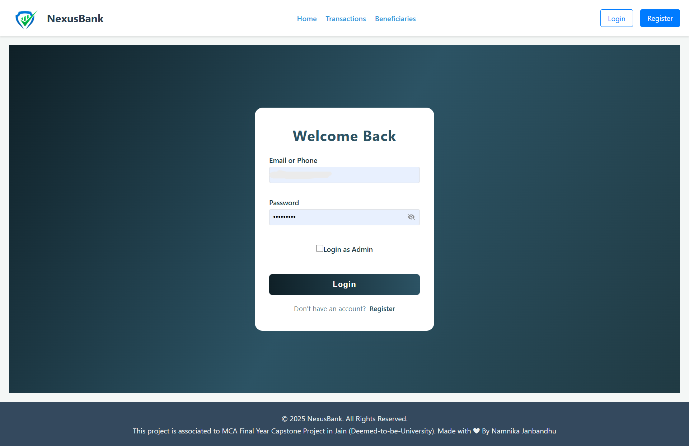
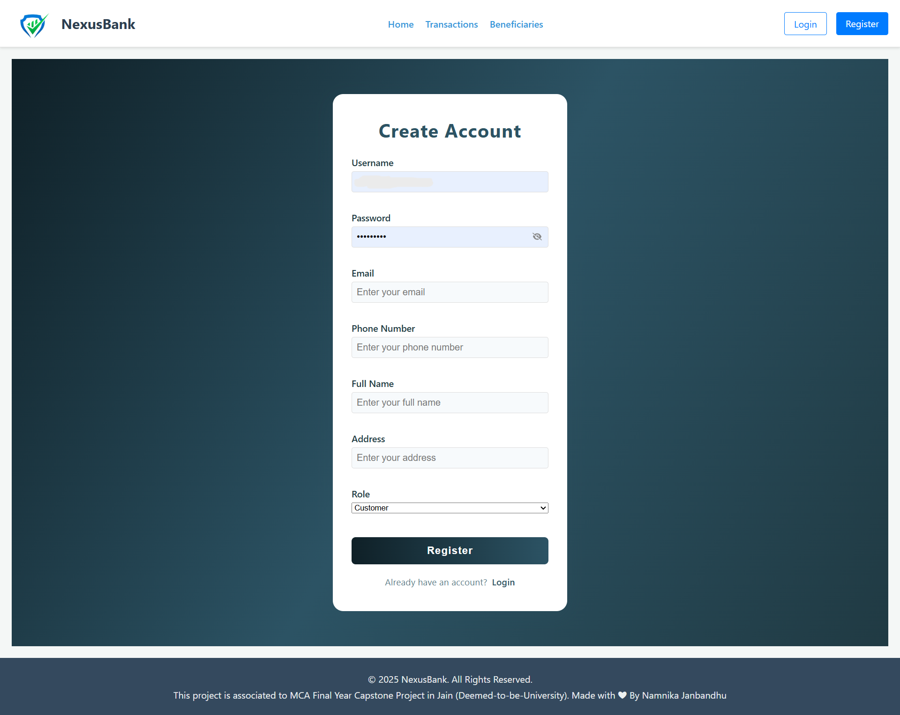
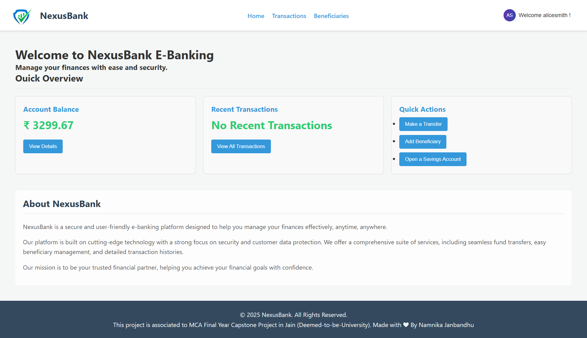
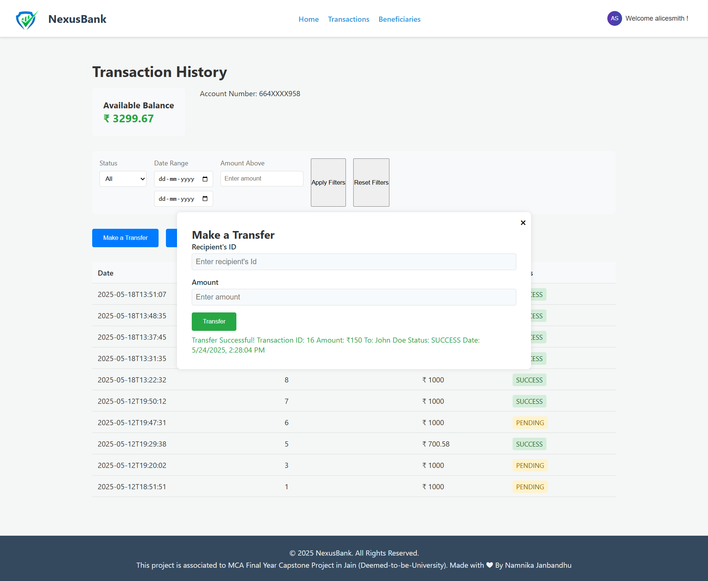
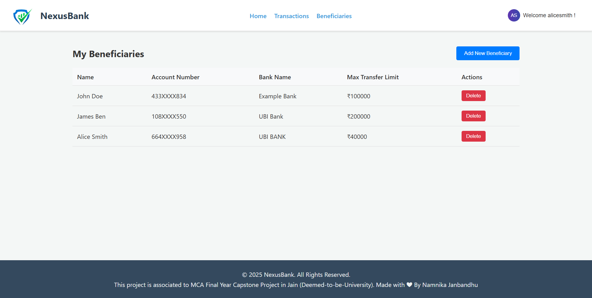
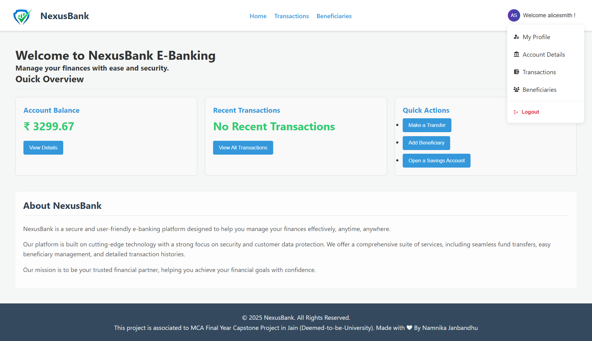
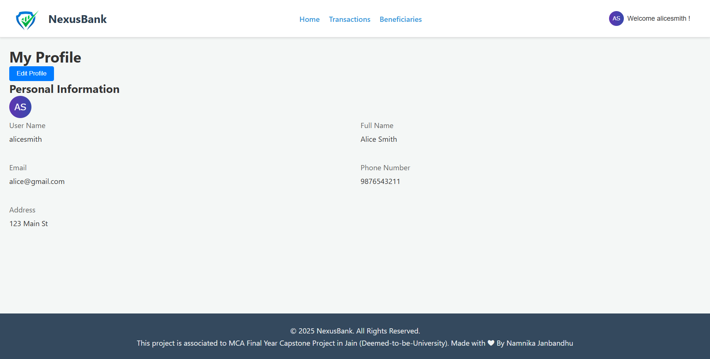
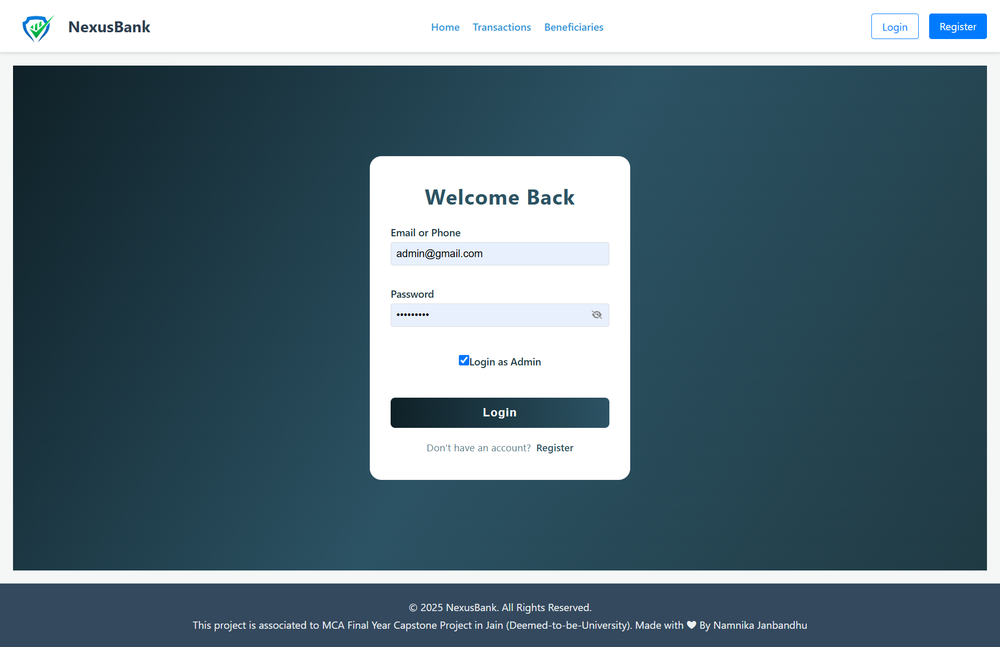
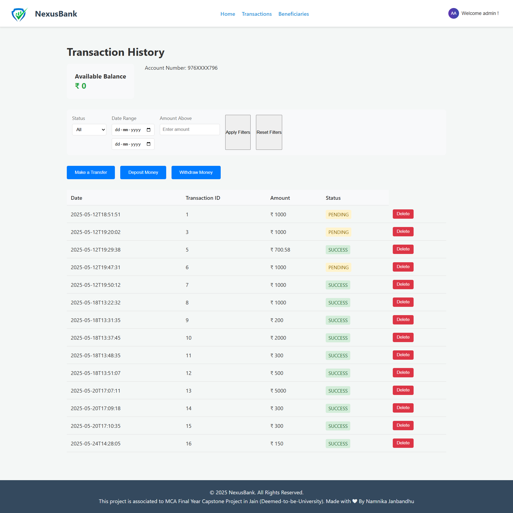

# E-Banking Application

A modern web-based banking application that provides secure banking services with user authentication, transaction management, and beneficiary management.

## Screenshots

#### Customer Visibility Page

- Login Page



- Register Page



- Customer Home Page



- Successfully Transaction Page




- Beneficiaries Page




- User Profile Actions




- User Profile Page




### Admin Access Page

- Login Page



- Transactions Deletion Page




## Features

- User Authentication (Login/Register)
- Role-based Access Control (Admin/Customer)
- Secure JWT-based Authentication
- Transaction Management
  - Deposit
  - Withdraw
  - Transfer
- Beneficiary Management
- Account Management
- Responsive UI Design

## Technologies Used

### Backend
- Java 21
- Spring Boot 3.x
- Spring Security
- JWT Authentication
- Spring Data JPA
- MySQL Database
- Maven

### Frontend
- React 19
- Axios for API calls
- React Router for navigation
- CSS for styling

## Prerequisites

- Java 17 or higher
- Node.js and npm
- MySQL Server
- Maven
- Microsoft VS Code

## Setup Instructions

### Backend Setup

1. Clone the repository:
```bash
git clone https://github.com/Namnika/E-BankingApplication.git
```

2. Configure MySQL database:
   - Create a database named `ebanking`
   - Update `application.properties` with your database credentials

3. Build and run the backend:
```bash
./mvnw clean install
./mvnw spring-boot:run
```

The backend server will start on `http://localhost:8080`

### Frontend Setup

1. Navigate to the frontend directory:
```bash
cd ../FrontendApplication
```

2. Install dependencies:
```bash
npm install
```

3. Start the development server:
```bash
npm start
```

The frontend application will start on `http://localhost:3000`

## API Endpoints

### Authentication
- POST `/users/register` - Register new user
- POST `/users/login` - User login
- GET `/users/profile` - Get user profile

### Transactions
- POST `/transactions/deposit` - Deposit money
- POST `/transactions/withdraw` - Withdraw money
- POST `/transactions/transfer` - Transfer money

### Beneficiaries
- POST `/beneficiaries` - Add new beneficiary
- GET `/beneficiaries` - Get all beneficiaries
- DELETE `/beneficiaries/{id}` - Remove beneficiary

## Security Features

- JWT-based authentication
- Password encryption
- Role-based access control
- CORS configuration
- Secure API endpoints

## Project Structure

```
E-BankingApplication/
├── BackendApplication/
│   ├── src/
│   │   ├── main/
│   │   │   ├── java/
│   │   │   │   └── com/backend/BackendApplication/
│   │   │   │       ├── config/
│   │   │   │       ├── controller/
│   │   │   │       ├── dto/
│   │   │   │       ├── model/
│   │   │   │       ├── repository/
│   │   │   │       ├── security/
│   │   │   │       └── service/
│   │   │   └── resources/
│   │   │       └── application.properties
│   └── pom.xml
└── FrontendApplication/
    ├── src/
    │   ├── components/
    │   ├── pages/
    │   ├── services/
    │   └── App.js
    └── package.json
```


## Contact

Namnika Janbandhu - namnika.janbandhu7@gmail.com

Project Link: [https://github.com/Namnika/E-BankingApplication](https://github.com/Namnika/E-BankingApplication) 